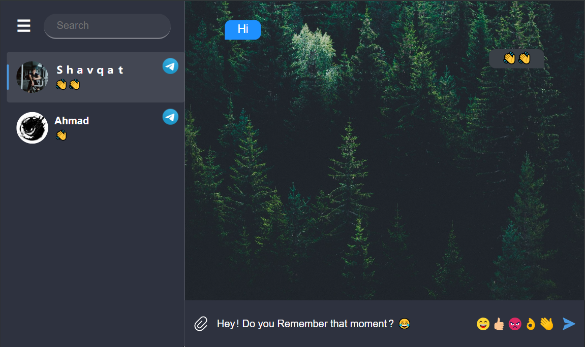

# This is a universal messenger
## It includes various technologies such as telegraf, whatsapp-web.js, websoket, express, mysql not to mention html, css and js.

### features:

<ul>
  <li>Telegram and WhatsApp on one interface</li>
  <li>Quick sending of messages to operators⚡️</li>
  <li>Multitasking</li>
  <li>Safety: The system has secure authentication.</li>
  <li>Clear division of roles: the administrator adds operators, the operators work with clients, and the analyst monitors.</li>
  <li>The system hides already occupied chats from other operators</li>
</ul>

